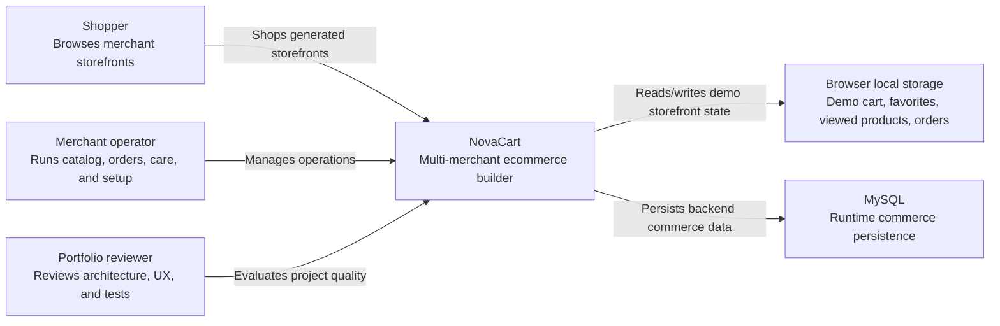
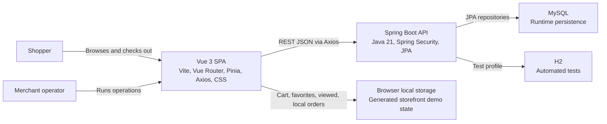
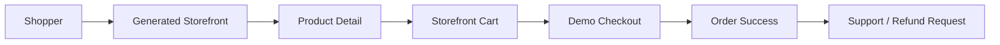
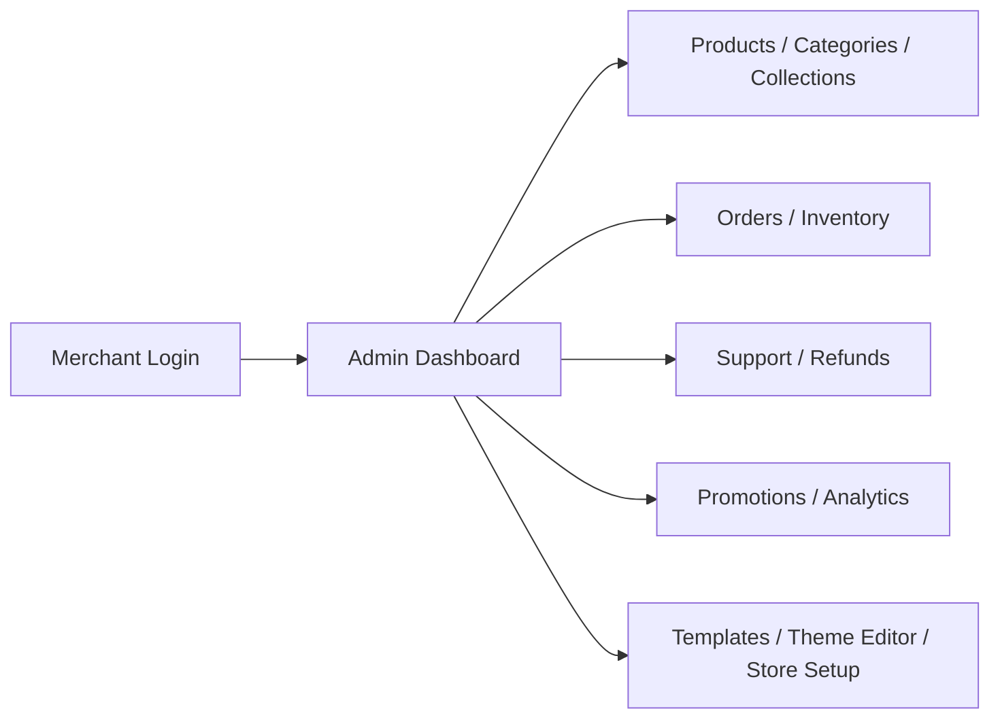

# NovaCart C4 Context And Containers

## System Context

NovaCart is a multi-merchant ecommerce website builder and operations demo. It serves three main audiences:

- Shoppers browsing generated storefronts, product detail pages, carts, checkout, order success, support, and refund flows.
- Merchants managing setup, products, categories, collections, promotions, orders, inventory, analytics, customers, support, refunds, templates, and theme settings.
- Portfolio reviewers evaluating full-stack architecture, product depth, UX quality, testing, and documentation.

## Container View

## Key Runtime Flows

## Component Groups

- `frontend/src/pages/platform`: public SaaS pages for positioning, templates, pricing, signup, and onboarding.
- `frontend/src/pages/store`: generated merchant storefront browsing, product detail, cart, checkout, order success, support, and refund UX.
- `frontend/src/pages/admin`: protected merchant operations workspace.
- `frontend/src/stores`: Pinia state for auth, platform/generated stores, legacy cart, generated storefront carts, favorites, and recently viewed products.
- `frontend/src/api`: Axios API layer with admin, catalog, order, and platform API modules.
- `backend/src/main/java/com/novacart/store/controller`: REST entrypoints for public commerce, care, auth, and admin operations.
- `backend/src/main/java/com/novacart/store/service/impl`: business logic for authentication, checkout/order consistency, inventory movements, promotions, analytics, support, refunds, customers, categories, and collections.
- `backend/src/main/java/com/novacart/store/entity`: JPA domain model for the commerce platform.
- `backend/src/test`: backend controller/service regression coverage with H2.
