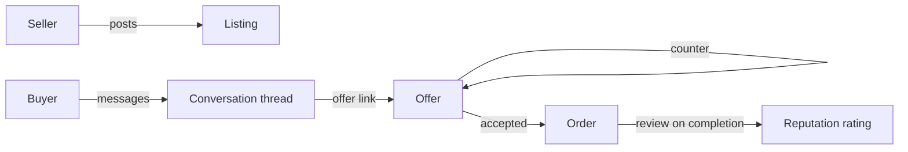

# ReNova — Second-Hand C2C Marketplace

ReNova is a portfolio-grade peer-to-peer second-hand marketplace where individuals list pre-loved goods, message each other, negotiate prices, place orders with escrow, ship, and rate. It is a clean rebuild of the project formerly known as NovaCart, repurposed from a multi-merchant SaaS into a C2C trading platform.

The frontend is bilingual (English / 简体中文) with a live language switcher in the header.

## What you can do as a user

- **Sign up** and immediately list items, browse, save favorites, and message any seller
- **Browse and search** by keyword, category, condition, price range, location, and sort
- **List an item** with title, description, photos, asking price, original retail, condition, location, shipping fee, and a flag for whether offers are accepted
- **Make offers and counter-offers** on negotiable listings (full back-and-forth thread with accept / reject / counter / withdraw)
- **Private messaging** between buyer and seller per listing, with unread badges in the header
- **Checkout** at list price or with an accepted offer — order is created in pending-payment state
- **Demo escrow flow**: buyer "pays" → seller marks shipped (with carrier + tracking) → buyer confirms receipt → order completes and the listing is marked sold
- **Two-way reviews** after a completed order — both buyer and seller can rate each other (1–5 stars + comment); user rating averages roll up to the profile
- **Public profile** for any user: listings, reviews received, location, average rating, member since
- **Favorites** list of saved items
- **Edit / remove** your own listings; archive sold ones

## Demo accounts (seeded on first launch)

| Email | Password | Notes |
|---|---|---|
| `ava@renova.local` | `DemoPassword1!` | Sample seller |
| `liam@renova.local` | `DemoPassword1!` | Sample seller |
| `nora@renova.local` | `DemoPassword1!` | Sample seller |
| `sam@renova.local`  | `DemoPassword1!` | Sample seller |
| `admin@renova.local` | `Demo Admin123!` | Admin role (no admin UI surface yet) |

You can also sign up fresh — accounts are created in two seconds.

## Architecture

### Backend (Spring Boot 4, Java 21, MySQL)

- **Entities**: `User`, `Category`, `Listing` (with `ListingCondition` + `ListingStatus`), `Favorite`, `Offer` (with counter-offer chains), `Conversation` + `Message`, `TradeOrder` (escrow state machine), `Review`
- **Auth**: BCrypt + JWT, stateless `SecurityFilterChain`, `AppUserDetailsService` reads from `users` table, `CurrentUserService` injects the authenticated user into services
- **Services**: `AuthService`, `ListingService`, `OfferService`, `MessagingService`, `OrderService`, `ReviewService`, `UserService`, `CategoryService`
- **REST endpoints**: `/api/auth/*`, `/api/public/listings`, `/api/listings/*`, `/api/offers/*`, `/api/conversations/*`, `/api/orders/*`, `/api/reviews`, `/api/public/users/*`, `/api/users/me`, `/api/public/categories`
- **Data seeding**: `DataInitializer` populates categories, demo users, and ~8 starter listings on first boot if the tables are empty
- **Validation**: Jakarta Bean Validation on every DTO, global `@RestControllerAdvice` shaped to a stable error envelope

### Frontend (Vue 3 + Vite + Pinia + vue-router + vue-i18n)

- **i18n**: full `en` and `zh` translation sets; locale switch in the topbar persists to `localStorage`
- **State**: `auth` (JWT + user) and `toast` Pinia stores; the auth store transparently persists across reloads
- **Pages** (16): Home, Browse, ListingDetail, PostListing, EditListing, MyListings, Favorites, Offers, Messages, Orders, OrderDetail, Checkout, Profile (public), MyProfile, Login, Signup, NotFound
- **Components**: `AppHeader` (search bar, unread badge, account menu), `AppFooter`, `LocaleSwitcher`, `ListingCard`, `Avatar`, `Stars`, `StarInput`, `ToastContainer`
- **Design system**: hand-rolled CSS tokens (Fraunces serif display + Inter body), warm off-white palette, single global stylesheet, no Tailwind / UI kit dependencies

## Core flows

```mermaid
flowchart LR
  Browse[Browse / Search] --> Detail[Listing detail]
  Detail -- Make offer --> Offer[Offer thread]
  Offer -- Accept --> Reserve[Listing reserved]
  Detail -- Buy now --> Checkout[Checkout]
  Reserve --> Checkout
  Checkout --> Pending[Order pending payment]
  Pending -- Pay (demo) --> Paid[Paid]
  Paid -- Seller ships --> Shipped[Shipped + tracking]
  Shipped -- Confirm receipt --> Done[Completed + listing marked SOLD]
  Done --> Review[Two-way review]
```





## Quick start

### Backend

```powershell
cd backend
.\mvnw.cmd spring-boot:run
```

Default base URL: `http://localhost:8080`. The first launch seeds categories, users, and listings.

Run tests:

```powershell
cd backend
.\mvnw.cmd test
```

### Frontend

```powershell
cd frontend
npm install
npm run dev
```

Default URL: `http://localhost:5173`. The dev server proxies `/api` to `http://localhost:8080`. Override with `VITE_API_BASE_URL` if you point at a remote backend.

Frontend build:

```powershell
cd frontend
npm run build
```

## Environment

Backend (defaults work locally without overrides):

```text
DB_HOST=localhost
DB_PORT=3306
DB_NAME=novacart
DB_USERNAME=novacart_user
DB_PASSWORD=novacart_password
JWT_SECRET=replace-with-a-long-random-secret
JWT_EXPIRATION_MINUTES=120
CORS_ALLOWED_ORIGINS=http://localhost:5173,http://127.0.0.1:5173
```

Frontend:

```text
VITE_API_BASE_URL=http://localhost:8080/api
```

## MySQL bootstrap

```sql
CREATE DATABASE novacart CHARACTER SET utf8mb4 COLLATE utf8mb4_unicode_ci;
CREATE USER 'novacart_user'@'localhost' IDENTIFIED BY 'novacart_password';
GRANT ALL PRIVILEGES ON novacart.* TO 'novacart_user'@'localhost';
FLUSH PRIVILEGES;
```

(JPA `ddl-auto: update` creates the tables on first run. For tests an H2 in-memory database is used.)

## Security notes

- All admin endpoints require `Authorization: Bearer <jwt>`; public endpoints sit under `/api/public/*` and `/api/auth/*`
- Passwords stored only as BCrypt hashes; never returned in responses
- Listings and offers enforce ownership at the service layer (a buyer can never modify a seller's listing and vice versa)
- This is a portfolio demo — **no real payments are processed**. The "pay" action is a demo state transition.

## Limitations (intentional, since this is a portfolio demo)

- No real payment provider integration (Stripe Connect etc.) — the escrow flow is a state machine, not a money flow
- No image upload pipeline — listings reference image URLs you paste in
- No realtime push for messages — open the messages page to refresh; the unread count refreshes on every route change
- No admin dashboard surface (admin role exists in the entity but no admin UI yet)
- No dispute resolution workflow — the entity supports `DISPUTED` state but there's no buyer-facing escalation page
- No mobile native app

## Tech stack

- **Backend**: Java 21, Spring Boot 4, Spring Data JPA, Spring Security, JJWT, Hibernate, MySQL (H2 for tests), Maven
- **Frontend**: Vue 3, Vite, Pinia, vue-router, vue-i18n, axios, plain CSS

## Project layout

```text
renova-marketplace/
  backend/
    src/main/java/com/novacart/store/
      config/         SecurityConfig, DataInitializer
      controller/     Auth, Listing, Offer, Conversation, Order, Review, Category, User
      dto/            *Dtos.java (records, grouped by domain)
      entity/         User, Category, Listing, Favorite, Offer, Conversation, Message, TradeOrder, Review + enums
      exception/      GlobalExceptionHandler + business exceptions
      repository/     Spring Data JPA repositories
      security/       JWT filter, JwtService, AppUserDetailsService, CurrentUserService
      service/        Business logic per domain
  frontend/
    src/
      api/            axios client + endpoint groups
      components/     reusable atoms (Header, Footer, ListingCard, Avatar, Stars…)
      i18n/           en + zh message bundles, locale switcher
      layouts/        MainLayout (header + footer wrap)
      pages/          16 routed pages
      router/         vue-router config with auth guard
      stores/         Pinia (auth, toast)
      utils/          formatting helpers
      assets/         single design-token stylesheet
```
