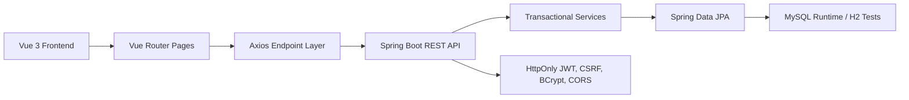

# ReNova Architecture

ReNova is a second-hand marketplace where users can discover listings, create seller profiles, post items, make offers, message each other, place orders, and leave reviews. The application is intentionally organized around real API contracts rather than browser-only mock commerce flows.

See also:

- [API reference](API.md)
- [Deployment notes](DEPLOYMENT.md)

## System Overview

## Backend Layers

- `controller`: HTTP boundaries for auth, public catalog, listings, offers, conversations, orders, reviews, and user profiles.
- `dto`: Request and response contracts plus consistent success/error envelopes.
- `service`: Transactional business rules, ownership checks, marketplace state changes, and DTO mapping.
- `repository`: Spring Data JPA access for users, categories, listings, favorites, offers, conversations, messages, orders, and reviews.
- `entity`: JPA models for marketplace users, listings, categories, offers, orders, reviews, and messaging.
- `security`: JWT generation, HttpOnly session-cookie parsing, current-user lookup, and security filter integration.
- `exception`: Domain exceptions and JSON error normalization.
- `config`: Security, CORS, password encoding, and local seed data.
- `util`: Shared infrastructure helpers such as enum parsing for stable API errors.

## Frontend Structure

- `api`: Axios client and endpoint modules. Components call these wrappers instead of constructing URLs inline.
- `assets`: Global CSS tokens, responsive layout primitives, buttons, forms, panels, and marketplace cards.
- `components`: Reusable UI such as header, footer, listing card, avatar, stars, locale switcher, and toasts.
- `i18n`: English and Chinese message bundles plus locale detection and persistence.
- `pages`: Route-level workflows for browse, listing detail, post/edit listing, checkout, offers, orders, messages, favorites, profile, login, and signup.
- `router`: Route definitions and auth guards.
- `stores`: Pinia auth and toast state.
- `utils`: Formatting and browser-storage helpers.

## Authentication Flow

1. A user signs up or logs in through `/api/auth/signup` or `/api/auth/login`.
2. The backend verifies credentials with BCrypt, sets the signed JWT in the HttpOnly `RENOVA_SESSION` cookie, and returns only the user summary and expiration time.
3. The frontend keeps the user summary in memory. It cannot read the session token.
4. The frontend obtains `XSRF-TOKEN`; Axios mirrors that value into `X-XSRF-TOKEN` for state-changing requests.
5. Protected backend routes resolve the current user from the cookie. Actor-scoped repository queries enforce private resource access.
6. Missing, expired, or invalid sessions return a consistent `401` JSON error.

## Marketplace Flow

1. Public visitors browse categories and active listings.
2. Authenticated sellers create listings with category, price, condition, shipping fee, and image URLs.
3. Buyers can favorite, message, make offers, or start checkout.
4. Accepted offers can be used in checkout, otherwise checkout uses the listing price.
5. Creating an order reserves the listing.
6. Payment, shipment, receipt confirmation, cancellation, and review steps move the order and listing through controlled states.

## API Boundary Rules

- Frontend code uses `frontend/src/api/endpoints.js` for route construction.
- `frontend/src/api/client.js` normalizes envelopes and errors and configures credentialed CSRF-aware requests.
- Browser storage is limited to non-sensitive preferences such as locale.
- Backend enum parsing returns business errors for invalid user input instead of leaking Java exceptions.
- Public user DTOs omit private fields such as email.
- Seed data is development data, not a substitute for persistence.

## Concurrency And Scale

The codebase is prepared for sane application behavior under load: protected routes are stateless, validation happens server-side, order/listing mutations are transactional, and frontend submissions are routed through explicit API calls.

Serving 100,000 simultaneous form clicks still requires deployment architecture outside this repository:

- CDN and static asset caching for the Vue build.
- Load-balanced Spring Boot replicas.
- MySQL production sizing, pooling, backups, and slow-query monitoring.
- Rate limits and request queues for bursty writes.
- Observability for latency, error rate, database pressure, and queue depth.
- Load tests that exercise login, listing search, offer creation, order creation, and payment-state transitions.

## Test Strategy

- Frontend unit tests cover formatting, i18n bundle shape, browser storage resilience, API error normalization, and endpoint route contracts.
- Backend tests cover public catalog reads, validation errors, real Cookie/CSRF exchange, password handling, cross-user authorization, image decoding and ownership, the persisted marketplace loop, idempotent checkout, concurrent buyers, and reservation expiry.
- Build checks run the Vite production build and the Spring Boot test profile.
