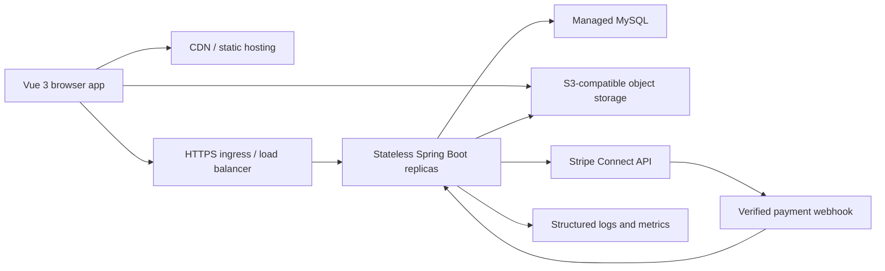

# ReNova AIDLC Stage 2: Design

Status: Accepted

Date: 2026-06-24

Branch: `codex/21st-motion-redesign`

Related audit: `docs/aidlc/01-inception-audit.md`

## 1. Design goals

ReNova will remain a modular monolith: one Vue application, one Spring Boot API, one MySQL database, and external providers only where the product genuinely needs them. The design prioritizes:

1. Passing and proving the three mandatory security gates before feature work.
2. A real persisted buyer/seller loop without mock APIs or client-only state.
3. Correct behavior when requests are retried or race each other.
4. A calm, legible interface that older adults can operate without training.
5. Purposeful motion adapted from 21st.dev without copying React code or adding an animation framework.
6. Deployment boundaries that can scale horizontally without introducing Redis, GraphQL, or microservices.

## 2. Non-goals

- ReNova will not run arbitrary user-authored HTML, CSS, JavaScript, or Vue templates.
- ReNova will not claim to process payments until a real provider webhook confirms payment.
- ReNova will not claim 100,000-user capacity from local tests or code inspection alone.
- ReNova will not add Redis or a message broker before measured load proves they are required.
- ReNova will not copy component source from 21st.dev. The references define interaction ideas only.

## 3. Target architecture



The Spring application remains a modular monolith. External storage and payments are integration boundaries, not new internal services.

## 4. Security model

### 4.1 Authentication

The current bearer token in `localStorage` will be removed.

Proposed session flow:

1. `POST /api/auth/signup` or `POST /api/auth/login` accepts credentials over HTTPS.
2. The backend verifies BCrypt and sets a signed JWT in an `HttpOnly` cookie named `RENOVA_SESSION`.
3. The cookie is `Secure` in production, `SameSite=Lax`, and scoped to `/api`.
4. The JSON response contains only `user` and `expiresAt`; it never contains the token, password, or hash.
5. Axios uses `withCredentials: true`. Pinia keeps only the current public user summary in memory.
6. `POST /api/auth/logout` expires the cookie. A refresh token is not introduced in the first secure version.

Cookie security is environment-aware so local HTTP tests work while production refuses insecure cookie configuration.

### 4.2 CSRF and CORS

Cookie authentication requires CSRF protection:

- Spring Security CSRF protection remains enabled for state-changing requests.
- The backend issues a readable `XSRF-TOKEN` cookie and requires the matching `X-XSRF-TOKEN` header.
- Axios sends the CSRF header automatically.
- State-changing requests also require an allowed `Origin`.
- Credentialed CORS accepts exact configured origins only. Wildcards are forbidden.
- Public `GET` endpoints remain cacheable and do not create a session.

### 4.3 Password rules

- Keep BCrypt for stored password hashes.
- Normalize email addresses before lookup and enforce the database unique constraint.
- Never log request bodies on auth routes.
- Remove all source-controlled demo passwords and client autofill.
- Optional demo seeding is disabled by default and available only under the explicit `demo` profile with a password supplied through an environment variable.
- Tests generate their own credentials and assert the stored value is a BCrypt hash different from the submitted password.

### 4.4 Authorization strategy

Authorization is enforced in services and repository queries, not Vue route guards.

- Public resources are loaded through public query methods.
- Private resources are loaded through actor-scoped repository methods such as `findByIdAndBuyerIdOrSellerId`.
- A private object that does not belong to the actor returns `404` to avoid confirming its existence.
- A visible public object that the actor cannot mutate, such as another seller's listing, returns `403`.
- Unauthenticated requests return `401`.
- Admin routes require `ROLE_ADMIN` through Spring method security and use separate admin services.
- Vue route metadata remains navigation UX only.

### 4.5 Protected endpoint matrix

| Endpoint | Required server policy | Denial |
| --- | --- | --- |
| `GET /api/auth/me` | Authenticated current user | 401 |
| `GET/PUT /api/users/me` | Authenticated current user only | 401 |
| `POST /api/listings` | Authenticated active user | 401/403 |
| `PUT/DELETE /api/listings/{id}` | Listing seller only | 403 |
| `GET /api/listings/mine` | Query by current seller ID | 401 |
| `GET /api/listings/favorites` | Query by current user ID | 401 |
| `POST /api/listings/{id}/favorite` | Authenticated user, listing must be public | 401/404 |
| `POST /api/offers` | Authenticated buyer, not listing seller | 401/403/409 |
| `POST /api/offers/{id}/accept|reject|counter` | Listing seller only | 404 |
| `POST /api/offers/{id}/withdraw` | Offer author only | 404 |
| `POST /api/offers/{id}/accept-counter` | Offer thread buyer only | 404 |
| `GET /api/offers/received|sent` | Query by current user ID | 401 |
| `GET /api/conversations` | Query by current participant ID | 401 |
| `POST /api/conversations` | Authenticated user, not listing seller | 401/403 |
| `GET /api/conversations/{id}` | Conversation participant only | 404 |
| `POST /api/conversations/{id}/messages` | Conversation participant only | 404 |
| `POST /api/orders` | Authenticated buyer, not listing seller | 401/403/409 |
| `GET /api/orders/{id}` | Buyer or seller only | 404 |
| `POST /api/orders/{id}/checkout-session` | Buyer only | 404/409 |
| `POST /api/orders/{id}/ship` | Seller only and paid order | 404/409 |
| `POST /api/orders/{id}/confirm-receipt` | Buyer only and shipped order | 404/409 |
| `POST /api/orders/{id}/cancel` | Buyer or seller under state policy | 404/409 |
| `GET /api/orders/buying|selling` | Query by current user ID | 401 |
| `POST /api/reviews` | Completed-order participant, one review per role | 404/409 |
| `GET /api/orders/{id}/reviews` | Order participant only | 404 |
| `/api/admin/**` | Active `ROLE_ADMIN` plus audited mutation | 403 |

Cross-user integration tests will call these APIs directly. UI visibility is not accepted as proof.

### 4.6 Secrets and logging

- Runtime database passwords, JWT keys, Stripe keys, webhook secrets, and storage credentials have no source-controlled fallback.
- Missing production secrets fail application startup.
- `.env.example` files contain variable names and non-working placeholders only.
- Test secrets are generated at test startup rather than committed.
- Structured logs include request ID, route, status, latency, and actor ID when available, but never password, cookie, authorization header, address, phone number, payment payload, or uploaded file body.
- CI scans the current tree for committed secrets. Git history exposure remains documented and requires rotation rather than a destructive history rewrite in this branch.

### 4.7 Abuse and burst controls

- The ingress rate-limits login, signup, upload-intent, message, offer, order, review, report, and admin mutation routes independently.
- Limits are configurable by environment and return `429` with `Retry-After`; they are not hard-coded into controllers.
- Order and payment correctness never depends on rate limiting. Database locks, constraints, and idempotency remain authoritative.
- Public reads use CDN/cache headers where their data contract permits it.
- A shared rate-limit service is not added until multi-replica load tests show that edge controls are insufficient.

## 5. Data and transaction design

### 5.1 Controlled schema migrations

- Add Flyway.
- New installations use a versioned baseline schema.
- Existing databases are backed up and baselined deliberately; Flyway will not silently bless an unknown schema.
- Production uses `hibernate.ddl-auto=validate`.
- H2 becomes test-scoped. Locking tests run against MySQL with Testcontainers because H2 cannot prove MySQL lock behavior.

### 5.2 Image upload

Arbitrary image URL text fields will be removed.

New `media_assets` data:

| Field | Purpose |
| --- | --- |
| `id` | Random UUID exposed to clients |
| `owner_id` | Authenticated uploader |
| `object_key` | Server-generated storage key |
| `content_type` | Allowlisted JPEG, PNG, or WebP |
| `byte_size` | Enforced upload limit |
| `width`, `height` | Verified image dimensions |
| `status` | `PENDING`, `READY`, `REJECTED`, `ATTACHED` |
| timestamps | Cleanup and audit |

Upload flow:

1. Client requests `POST /api/media/upload-intents` with file name, MIME type, and size.
2. Backend validates limits and returns a short-lived presigned object-storage upload.
3. Browser uploads directly to S3-compatible storage.
4. Client calls `POST /api/media/upload-intents/{id}/complete`.
5. Backend reads the object, verifies that it decodes as an allowed image, strips unsafe metadata by re-encoding, records dimensions, and marks it `READY`.
6. Listing create/update submits owned `mediaIds`; the backend atomically marks them `ATTACHED` in display order.
7. Unattached uploads expire and are deleted by a bounded scheduled cleanup job.

Limits: 8 images per listing, 10 MB source file, 20 megapixels, no SVG, HTML, or arbitrary URL ingestion. Images are served with fixed content types and `X-Content-Type-Options: nosniff` through a CDN.

Local development uses MinIO through Docker Compose. Production can use an S3-compatible provider selected during Operations without changing listing code.

### 5.3 Idempotent, race-safe checkout

`POST /api/orders` adds an `Idempotency-Key` UUID header generated once per submit attempt.

Database changes:

- `trade_orders.idempotency_key`
- unique constraint on `(buyer_id, idempotency_key)`
- `trade_orders.request_fingerprint`
- `trade_orders.reservation_expires_at`
- `@Version` on mutable orders
- indexes for listing/status/reservation expiry

Transaction:

1. Lock the listing row with `PESSIMISTIC_WRITE`.
2. Return the existing order when the same buyer and idempotency key repeat with the same payload fingerprint.
3. Return `409` when the key is reused with a different payload.
4. Validate listing status and accepted-offer ownership while holding the lock.
5. Reject a second active order for the listing.
6. Create the order and reserve the listing in the same transaction.
7. Expire unpaid reservations with conditional updates so multiple replicas cannot release the same reservation incorrectly.

Two concurrent buyers must produce one reservation and one conflict. A repeated browser click must produce one order.

### 5.4 Real payments

The fake `POST /api/orders/{id}/pay` endpoint will be deleted.

Proposed provider: Stripe Connect with Stripe-hosted connected-account onboarding and Checkout. Runtime code has one real Stripe adapter; tests replace the network boundary only.

Payment flow:

1. Seller completes Stripe connected-account onboarding before accepting online payments.
2. Buyer requests `POST /api/orders/{id}/checkout-session`.
3. Backend creates a Stripe Checkout Session with an idempotency key and stores provider IDs.
4. Browser redirects to Stripe-hosted Checkout.
5. ReNova marks an order paid only after verifying the webhook signature against the raw request body.
6. Provider event IDs are unique in `payment_events`, so webhook retries are idempotent.
7. Cancellation/refund state is driven by provider results and webhooks, not a client button.

Stripe's marketplace model makes the platform responsible for fees, disputes, refunds, and connected-account negative-balance risk. As of 2026-06-24, the New Zealand pricing page lists payment and Connect fees that vary by pricing model. The owner must create the Stripe account, complete business/KYC checks, accept those costs and responsibilities, and supply test/production secrets through the hosting secret manager.

Official references:

- https://docs.stripe.com/connect/marketplace
- https://stripe.com/nz/connect/pricing
- https://docs.stripe.com/webhooks/signature

No live payment feature will be claimed until those owner-controlled prerequisites exist and Stripe test-mode verification passes.

## 6. Admin and moderation design

The admin is an operational interface, not a storefront theme editor.

Initial admin routes:

- `/admin`: operational counts and items needing attention.
- `/admin/users`: search, inspect public/account status, suspend/reactivate.
- `/admin/listings`: search, hide/restore listings with a required reason.
- `/admin/orders`: read-only support view with private fields revealed only to admins.
- `/admin/reports`: review user reports and record a resolution.
- `/admin/audit`: immutable record of admin mutations.

Rules:

- No password view/reset, token view, or silent impersonation.
- Every mutation records admin ID, action, target type/ID, reason, timestamp, and request ID.
- Tables use server pagination/filtering.
- Admin APIs use dedicated DTOs and never return entity objects directly.
- User suspension blocks new sessions and privileged actions but preserves transaction history.
- The first admin is promoted by a one-off deployment command that succeeds only when no admin exists. It promotes an already registered account, records an audit event, and never creates or prints a password.

## 7. Frontend information architecture

Public marketplace:

- Home: ReNova identity, full-bleed real listing imagery, prominent search, categories, recent listings.
- Browse: persistent search, filter chips, desktop filter rail, mobile filter sheet, real pagination.
- Listing: image gallery, seller trust information, offer/contact/buy actions, clear item status.

Authenticated workspace:

- Sell: three short steps for photos, item details, and delivery/confirmation.
- My listings: active/reserved/sold tabs with edit/status actions.
- Inbox and offers: unified trade context with listing thumbnail and participant.
- Orders: buyer/seller segmented views and a real state timeline.
- Account: profile, security, payment onboarding, and sign out.

Admin:

- Compact sidebar, data tables, filters, bulk selection only where an operation is reversible, and explicit confirmation for destructive actions.

## 8. Visual and motion system

### 8.1 Direction

The visual direction is a contemporary resale catalogue: editorial enough to make individual objects feel valuable, but quiet and practical during repeated trading tasks.

- Body font: self-hosted Atkinson Hyperlegible for older-adult readability.
- Display font: self-hosted Newsreader for ReNova identity and listing/editorial headings.
- Chinese text uses the operating system's CJK sans/serif stack so the Latin font download does not force a multi-megabyte CJK bundle.
- Base: soft white and graphite, not a beige-only interface.
- Functional colors: forest green for trust, cobalt for navigation/information, coral for high-attention actions, and explicit red/amber status colors.
- Cards and panels use a maximum 8 px radius.
- Hero uses real marketplace imagery as a full-bleed background, not a gradient or split card.
- Body text is at least 16 px; controls have at least 44 by 44 px pointer targets.

Proposed core tokens: soft white `#F7F7F2`, graphite `#171918`, forest `#205C43`, cobalt `#2457D6`, coral `#E85D3F`, danger `#B42318`, and amber `#A15C00`.

### 8.2 Motion tokens

| Token | Value | Use |
| --- | --- | --- |
| `--motion-fast` | 120 ms | Press, focus, icon feedback |
| `--motion-base` | 180 ms | Card/image/filter transitions |
| `--motion-slow` | 280 ms | Dialog and route entrance |
| `--ease-standard` | cubic-bezier(.2,.8,.2,1) | Most transitions |
| `--ease-exit` | cubic-bezier(.4,0,1,1) | Elements leaving |

`prefers-reduced-motion: reduce` removes transforms, parallax, autoplay, and stagger delays while preserving immediate state changes.

### 8.3 21st.dev adaptations

| Reference pattern | ReNova implementation | Product purpose |
| --- | --- | --- |
| Product Card | Image lift up to 3%, directional highlight on pointer devices, stable price/status layout | Makes scanning feel responsive without moving the grid |
| Expandable Card | Accessible native-dialog quick view that reuses listing summary data and links to full detail | Lets buyers inspect an item without losing filters |
| Shine Hover | Restrained highlight on the single primary action in a surface | Clarifies the next action, never decorative autoplay |
| Animated Carousel | Keyboard-controlled recent-listing rail with segmented position indicator | Browse real inventory, not explain app features |
| Gallery transitions | Crossfade plus thumbnail focus movement | Maintains continuity while inspecting condition |

Implementation uses Vue `Transition`, `TransitionGroup`, CSS, and a small `useReducedMotion` composable. No animation dependency is added unless native behavior proves insufficient.

### 8.4 Page motion map

- Route change: 8 px fade/translate, 180 ms, disabled for reduced motion.
- Home load: one staggered reveal for brand, search, and imagery; no repeated scroll theatrics.
- Browse filters: chip insertion/removal and a mobile sheet; result skeleton dimensions match listing cards.
- Listing grid: enter/move transitions only after user filter/sort actions, not on every scroll.
- Quick view: backdrop fade and 12 px dialog rise; focus moves into and returns from the dialog.
- Gallery: crossfade with fixed aspect ratio so layout never shifts.
- Sell form: upload progress, reordering, success/error state, and submit lock while the request is in flight.
- Order timeline: current state advances visibly after confirmed server responses or webhooks.
- Toasts: short slide/fade with `aria-live`; errors remain available inline and are not toast-only.

### 8.5 Older-adult usability rules

- Keep primary tasks to one obvious action per screen and use plain verbs such as Sell, Save, Pay, Ship, and Cancel.
- Preserve labels above fields; placeholders never replace labels.
- Use inline validation next to the field and move focus to the first invalid field after submit.
- Keep reading lines near 70 characters, maintain WCAG 2.2 AA contrast, and never encode status by color alone.
- Confirm destructive actions with the item name and consequence. Successful reversible actions offer Undo where the server contract supports it.
- Save an in-progress listing draft locally without storing credentials or private payment data.

## 9. Maintainable code boundaries

No repository-wide rewrite is proposed.

Backend additions follow existing layers:

```text
controller/  Auth, Media, Admin, Payment HTTP contracts
dto/         Explicit request/response records
entity/      MediaAsset, PaymentEvent, AdminAuditLog, Report
repository/  Actor-scoped queries and locking queries
service/     Domain transactions and provider coordination
security/    Cookie JWT, CSRF, current actor, access policies
config/      Typed configuration properties
```

Frontend additions:

```text
api/         Domain endpoint modules and cookie-aware client
components/  listing, media, motion, feedback, admin primitives
composables/ useReducedMotion, useUploadQueue, useIdempotentSubmit
pages/       Existing public/account routes plus admin routes
styles/      Tokens, base, components, motion, responsive utilities
```

Repeated state checks become named domain policies or state-transition methods. They are not implemented as controller-specific chains of `if` statements.

## 10. Verification design

### Security gate proof

- Gate 1: signup stores a BCrypt hash; login succeeds/fails correctly; auth responses and serialized users contain no password/hash/token; source scan finds no plaintext demo credential.
- Gate 2: user A receives denial when directly updating/deleting user B's listing and reading user B's order/conversation/private profile; admin tests prove role enforcement; every protected endpoint has at least one unauthorized test.
- Gate 3: tracked-tree and history scan report is attached; runtime starts only with injected secrets; `.env` remains ignored; examples contain placeholders only.

### Correctness proof

- MySQL integration test launches two concurrent checkout transactions and proves one reservation.
- Repeated idempotency key returns the same order; mismatched payload returns 409.
- Upload tests reject wrong MIME, spoofed files, excessive size/dimensions, and another user's media ID.
- Stripe test mode verifies checkout creation, signed webhook handling, duplicate events, and no client-side paid transition.
- Browser E2E covers register/login, upload, listing CRUD, browse/search, contact/offer, checkout, admin moderation, and logout.

### UI proof

- Playwright captures desktop and mobile states.
- Keyboard-only navigation covers menus, filters, quick view, forms, and dialogs.
- Reduced-motion emulation proves content remains usable without animation.
- Automated accessibility checks are supplemented by focus-order and readable-error checks.
- No overlap, clipping, layout shift, or blank imagery at supported viewports.

### Load proof

The load suite distinguishes three scenarios:

1. 100,000 duplicate form submissions using one idempotency key must create one record.
2. Many buyers racing for one listing must create one reservation and conflicts for the rest.
3. Distributed unique writes across many listings measure throughput, p95 latency, error rate, connection-pool pressure, and database locks.

The repository will include k6 scenarios and thresholds, but a 100,000-concurrent-user claim requires a production-like staging environment and paid infrastructure. Rate limiting may reject abusive excess traffic while remaining stable; stability does not mean every request must be accepted.

## 11. Construction sequence and review stops

After this design is approved, AIDLC Stage 3 proceeds in these reviewable increments:

1. **Gate 1**: remove plaintext credentials, harden password handling, add proof tests, commit, push, stop.
2. **Gate 2**: centralize server authorization, fix endpoint semantics, add cross-user proof tests, commit, push, stop.
3. **Gate 3**: remove runtime secret defaults, add fail-fast configuration and scans, commit, push, stop.
4. **Correctness**: Flyway, media upload, idempotent locked checkout, real Stripe test-mode integration.
5. **Admin**: moderation APIs, audit log, and operational UI.
6. **Frontend**: information architecture, accessibility, font/palette, and purposeful motion.
7. **Structure**: split oversized endpoint/style modules only where the completed behavior creates a clear boundary; pin dependencies and remove stale artifacts.

Stage 4 performs the full verification matrix. Stage 5 adds production deployment configuration, operations guidance, backups, monitoring, and final documentation.

## 12. Approval items

Approval of this design confirms:

- HttpOnly cookie authentication with CSRF replaces browser-stored bearer tokens.
- S3-compatible object storage plus MinIO local development is acceptable.
- Stripe Connect is the intended real payment provider, subject to owner account/KYC/cost approval.
- Admin scope is marketplace moderation and operations, not arbitrary storefront template scripting.
- The visual direction, self-hosted fonts, accessibility targets, and native Vue motion approach are accepted.
- Construction stops after each security gate for review before any feature work.
